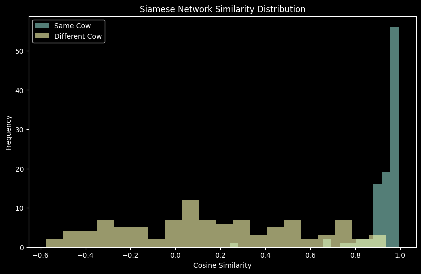

# Muzzle Net

### Deep Learning Based Cattle Identification using Muzzle Pattern Recognition

MuzzleNet is a deep learning project focused on **biometric identification of cattle** using unique muzzle patterns. Similar to human fingerprints, every cow has a distinct muzzle texture, making it a reliable biometric feature for livestock identification.

---

## Current Results

Example similarity scores from testing:

**Same Cow**
```text
Mean: 0.935258
Min : 0.24305052
Max : 0.99367917
```
**Different Cow**
```text
Mean: 0.1563636
Min : -0.57475066
Max : 0.9371778
```

### Similarity Distribution


---

## Research Reference

### Reference Paper

[Deep Learning-Based Cattle Identification Using Muzzle Pattern Images](https://www.sciencedirect.com/science/article/pii/S2772375525004307)

[Cattle Identification using Muzzle Images and Deep Learning Techniques](https://www.researchgate.net/publication/379574143_Cattle_Identification_using_Muzzle_Images_and_Deep_Learning_Techniques)

---

## Dataset Used

The project uses **Zenodo Beef Cattle Muzzle** Dataset

[Download Dataset](https://zenodo.org/records/6324361)